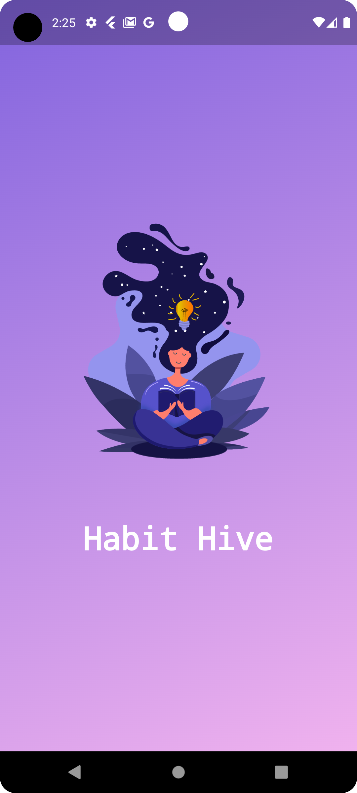

# Habit Tracking App

**Overview**  
The Habit Tracking App is designed to help users effectively manage their daily and weekly habits. With a user-friendly interface and a range of features, users can seamlessly track their progress and stay motivated.

## Key Features
- **Secure Login**: Authenticate using Google, email, and password. (Note: Facebook and Instagram login options are currently unavailable.)
- **Detailed Habit Management**: Add habits with descriptions, durations, dates, and categories (e.g., Work, Study, Sports).
- **Real-Time Progress Tracking**: Monitor daily progress on the Home Page.
- **Weekly Progress Visualization**: View progress through visual charts that show the completion rate of habits.
- **Daily Notifications**: Receive reminders every day at 1 PM to track your habits.

## Getting Started
1. Upon reaching the Welcome Page, you have three options:
   - **Login** with an existing email and password.
   - **Sign Up**: Enter a valid email address to receive a verification link on Gmail. Note: You must verify your account before logging in.
   - **Login with Google**: Use your Google account for quick access.

2. After logging in, you will be directed to the Home Page, where you can:
   - Add, edit, or delete habits.
   - Track your daily progress.

3. To track a specific habit, click on the description of the habit to navigate to the Habit Tracking page. Here, you can analyze your progress for the current and previous weeks, represented in a chart showing the completion rates of all added habits.

4. Access the Profile page to view user data, change your password, log out, or permanently delete your account.

## Photos of Screens

### Splash Screen

  

### Onboarding Screens

  
  
  

### Welcome Screen

  

### Sign In and Sign Up Screens

  
  

### Home Page

  

### Adding and Editing Habits

  
  

### Tracking Habits

  
  

### Profile Screens

  
  

